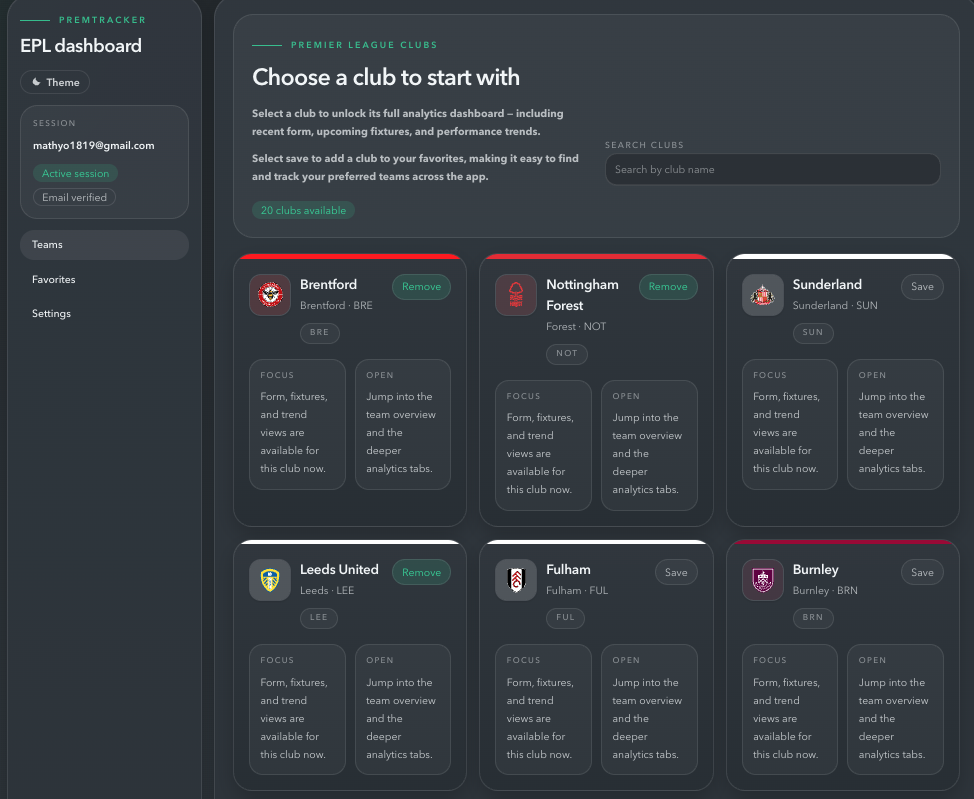
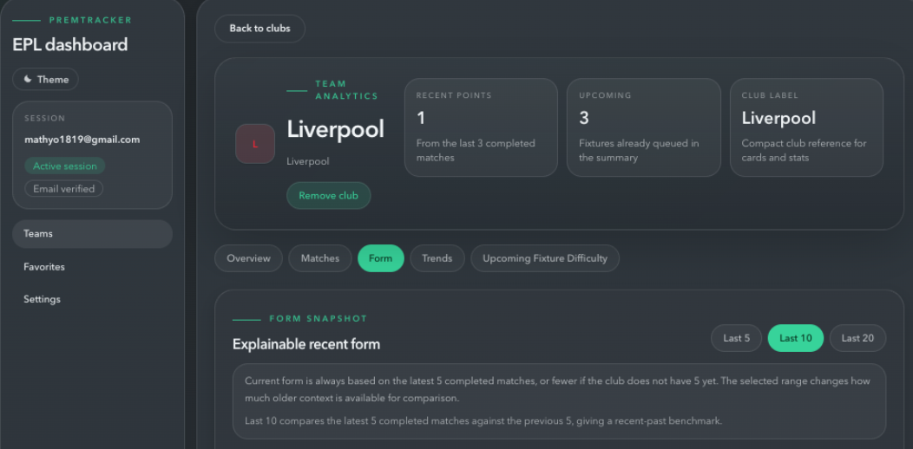
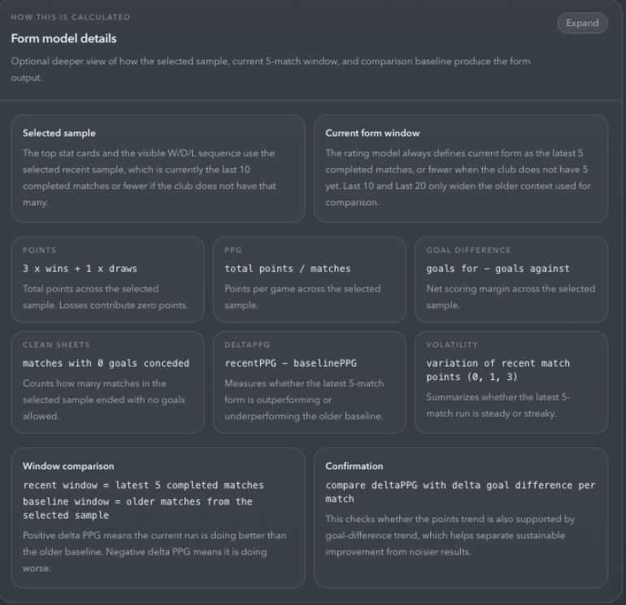
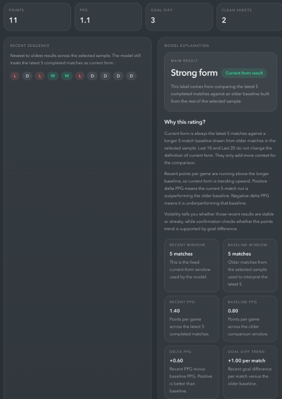
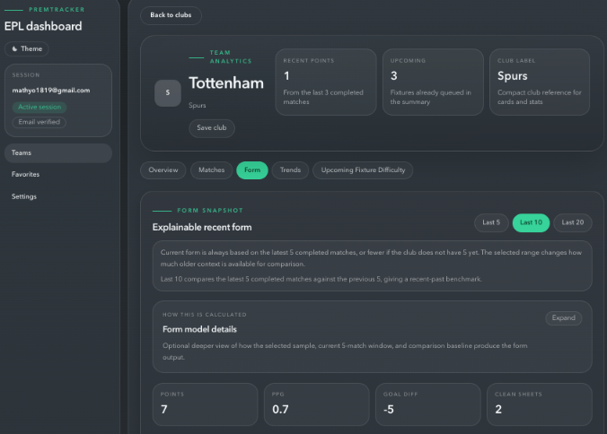
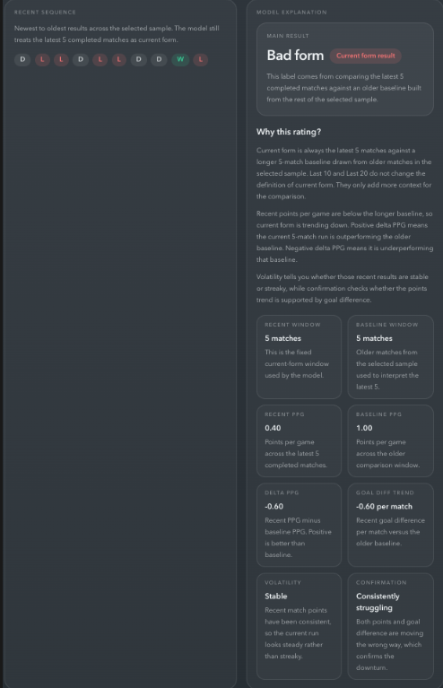
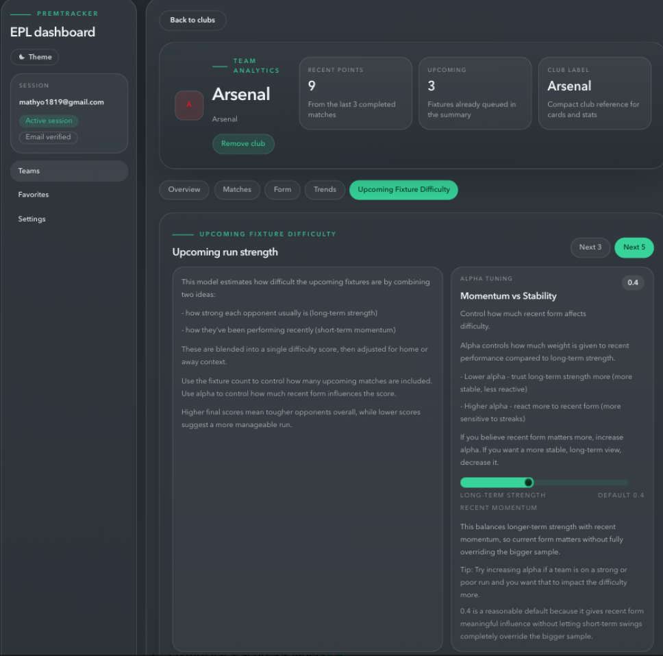
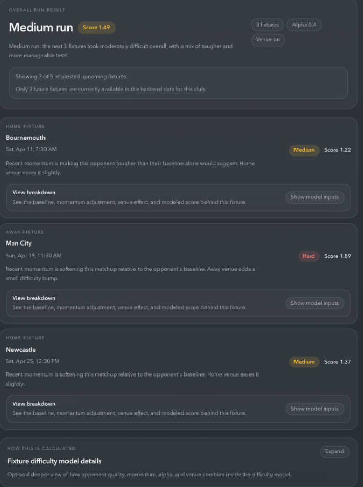
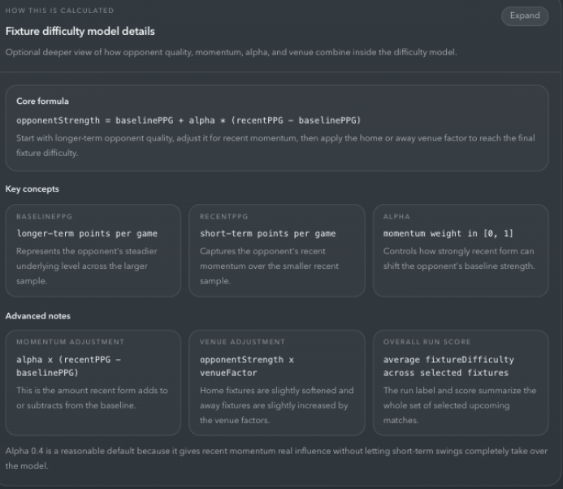

# PremTracker

**Explainable Premier League analytics built for real users, not just stat tables.**

**Live Site:** [https://premtracker.pro/](https://premtracker.pro/)

PremTracker is a frontend for exploring Premier League team analytics through a clear, interactive, and explainable product experience. I’m a Rutgers University student studying **Computer Science and Mathematics**, and this project reflects my belief that mathematics should not be hidden behind abstractions, but used as a tool to make real-world systems more understandable.

In soccer analytics, that means moving away from black-box scores and toward systems people can actually reason about. The backend establishes the models and analytics. This frontend turns those models into something visible, interactive, and understandable.

It is a product about soccer, but it is also a product about **making technical thinking accessible**.

---

## Product Overview

PremTracker helps users follow Premier League clubs through an analytics dashboard that prioritizes **clarity over mystery**.

Instead of asking users to trust non-transparent ratings, the app shows:
- what the current output is
- what inputs were used
- what comparison was made
- and why the result makes sense

Users can browse clubs, inspect recent form, study rolling trends, evaluate upcoming fixture difficulty, save favorite teams, manage reminder preferences, and interact with analytics in a way that feels readable rather than overwhelming.

This frontend exists because raw models are not enough on their own. Good analytics need good UX. PremTracker is an attempt to bridge that gap.

---

## Why This Project Exists

A lot of sports analytics products either:
- overload users with numbers and charts
- or hide their logic behind polished but unexplained scores

PremTracker takes a different approach.

The goal is not to create a black-box prediction engine. The goal is to build a system where users can answer:

> “Why is this the result?”

That is the core intellectual idea behind the project:
- build mathematically grounded analytics
- expose the reasoning clearly
- and let users interact with the model

---

## Key Features

### Explainable Form Model
The form tab is designed around the idea that **current form should be understandable, not just labeled**.

Users can see:
- recent points, PPG, goal difference, and clean sheets
- the recent W/D/L sequence
- the form rating
- the model inputs behind that rating
- a collapsible “How this is calculated” explanation

The UI makes clear that:
- current form is always based on the latest 5 completed matches
- larger sample options like Last 10 and Last 20 provide comparison context
- the rating is based on recent-vs-baseline comparison, not a vague summary label

### Rolling Trends
The trends tab shows the bigger picture.

Instead of only showing what a team is right now, it helps answer:
- Is performance improving or declining over time?
- Is current form part of a broader pattern?
- Are recent results just short-term noise?

It uses rolling windows, trend direction, deltas, and mini charts to make the evolution of performance visible and interpretable.

### Fixture Difficulty Modeling
The fixture difficulty tab is one of the strongest product features in the app.

It helps users answer:
- How hard is the next run of games?
- Why is one fixture rated harder than another?
- How much should recent opponent momentum matter?

Users can:
- view the overall run score and label
- inspect per-fixture difficulty breakdowns
- tune the `alpha` parameter
- read collapsible model details explaining the formula and assumptions

### Favorites + Email Reminders
Users can save teams they care about and build a more personal dashboard experience.

The app supports:
- favorites management
- verification-aware settings
- reminder opt-in
- manual fixture digest sending
- future-ready UX for scheduled reminder delivery

### Admin Sync System
The frontend includes an admin-only sync surface for triggering protected backend data refreshes.

It includes:
- admin-only UI gating
- clear Sunday-only messaging
- rate-limit-aware feedback
- live reporting of sync results

### Authentication And Recovery Flows
The app includes a full account lifecycle:
- register
- login
- refresh-based session restore
- logout
- forgot password
- reset password
- verify email

These flows are designed to feel product-ready rather than purely functional.

---

## Analytics Philosophy

PremTracker is **not** a black-box ML product.

That distinction matters.

This project is built around the idea that users should be able to:
- see how metrics are derived
- inspect the reasoning behind outputs
- interpret trends themselves
- adjust certain parameters intentionally
- understand what a score means before they trust it

The product does not try to replace user judgment. It tries to support it.

That means:
- form is explained, not just labeled
- trends are shown as movement over time, not static outputs
- fixture difficulty is parameterized and inspectable
- model details are available, but not forced on every user

This is a **human + model interaction** philosophy, not a “trust the algorithm” philosophy.

---

## Mathematical Modeling

PremTracker uses simple but meaningful mathematical structures and then exposes them through UI.

### Rolling Windows
A rolling window tracks performance across overlapping samples of recent matches.

Instead of asking “what happened in one game?”, rolling windows ask:
- what does performance look like across a recent span?
- is that span improving or slipping relative to the last one?

This helps smooth one-off noise without hiding directional change.

### Recent vs Baseline Comparison
The form model distinguishes between:
- a **recent window**: the latest 5 completed matches
- a **baseline window**: older matches from the selected broader sample

That allows the product to ask:
- is the team currently outperforming its recent past?
- is the current run actually different from the baseline?

This is more useful than simply averaging a long span and calling it “form.”

### Delta Metrics
Several parts of the app use deltas to explain movement.

Conceptually:

```txt
delta = current value - comparison value
```

For example:
- positive `deltaPPG` means the team is earning more points per game recently
- negative `deltaPPG` means current form is below the baseline
- trend deltas compare the latest rolling window to the previous rolling window

This makes performance change explicit rather than implied.

### Volatility
The form model also includes volatility as an interpretive signal.

Volatility answers:
- is this recent run stable?
- or is it streaky and noisy?

That matters because two teams can have similar short-term results with very different consistency profiles.

### Fixture Difficulty Formula
Fixture difficulty is modeled using an opponent strength calculation that balances long-term quality with recent momentum:

```txt
opponentStrength = baselinePPG + alpha * (recentPPG - baselinePPG)
```

Where:
- `baselinePPG` = longer-term opponent strength
- `recentPPG` = short-term recent opponent form
- `alpha` = how much recent form should influence the final score

### What Alpha Means
`alpha` controls **responsiveness vs stability**.

- Lower alpha:
  - trusts longer-term strength more
  - more stable
  - less reactive to short-term swings

- Higher alpha:
  - reacts more to recent form
  - more sensitive to streaks
  - makes momentum matter more

This is a good example of the project’s philosophy: a mathematical parameter is not hidden. It is explained, exposed, and connected to intuition.

---

## Tech Stack

### Frontend
- **Next.js 16** (App Router)
- **React 19**
- **TypeScript / TSX**
- **Tailwind CSS v4**
- **DaisyUI v5**

### Backend
This frontend builds on the **PremTracker-Backend**, available in my public repositories.

That backend handles:
- Node.js + Express API architecture
- PostgreSQL data storage
- Knex migrations/query layer
- JWT-based auth
- rotating refresh-token sessions
- Upstash Redis rate limiting
- email flows and verification
- analytics and data modeling logic

---

## Architecture Notes

PremTracker is intentionally built as a **frontend/backend split system**.

### Frontend Responsibilities
The frontend focuses on:
- product UX
- rendering analytics clearly
- interaction design
- auth/session handling
- state transitions
- model explanation

### Backend Responsibilities
The backend focuses on:
- data ingestion
- persistence
- analytics logic
- auth/security rules
- protected workflows
- email and admin operations

This separation keeps the system clean:
- backend defines the source of truth
- frontend turns that truth into an understandable interface

It is an API-driven architecture built around explainable systems rather than hidden coupling.

---

## UX Design Highlights

A major part of the technical work in this repository is **not just rendering data**, but designing interfaces that make analytics readable.

Highlights include:
- explainable UI cards for form, trends, and fixture difficulty
- collapsible model explanation panels
- interactive alpha tuning for fixture difficulty
- meaningful loading and pending feedback
- auth and recovery flows that feel product-ready
- responsive mobile layouts
- clear empty, error, and restricted states
- protected admin tooling with explicit feedback
- visual hierarchy that separates:
  - output
  - inputs
  - explanation

This is important to me because good technical systems should not become inaccessible simply because they are mathematically rich.

## Screenshots

### Teams Home Page


---

### Form Analysis (Explainable Model)

<div align="center">
  
  
  
</div>

- Left: Team-level form snapshot with real match sequence (Liverpool example)  
- Middle: Core model definitions (PPG, deltaPPG, rolling windows)  
- Right: Final explainable result with reasoning behind the rating  

---

### Trends Analysis (Rolling Performance)

<div align="center">
  
  
</div>

- Left: Recent match sequence and trend snapshot (Tottenham example)  
- Right: Explainable model output showing why form is trending downward  

---

### Fixture Difficulty (Explainable Model + Controls)

<div align="center">
  
  
  
</div>

- Left: Interactive model with alpha tuning and run selection (Arsenal example)  
- Middle: Per-fixture breakdown showing how difficulty is computed  
- Right: Core mathematical model and variables behind the system  

---

## Getting Started

### 1. Install dependencies

```bash
npm install
```

### 2. Set environment variables

Create a `.env.local` file in the project root:

```env
NEXT_PUBLIC_API_URL=https://premtracker-api.onrender.com
```

### 3. Run the development server

```bash
npm run dev
```

### 4. Build for production

```bash
npm run build
npm run start
```

---

## Local Development Notes

The frontend expects the deployed backend API through:

```env
NEXT_PUBLIC_API_URL=
```

All API requests are built against that environment variable rather than browser-relative `/api/...` routes.

---

## Future Improvements

There are several directions this project could grow:

- a predictive layer built on top of the current explainable analytics foundation
- support for more leagues beyond the Premier League
- deeper statistical modeling and comparative views
- richer personalization around favorite clubs and notification preferences
- improved social sharing / public team dashboards
- expanded visual storytelling for match and trend analysis

The key constraint for future work would stay the same:
**new analytics should remain understandable, not just more complex.**

---

## Closing Note

PremTracker is a soccer analytics project, but it is also a reflection of how I think about computer science and mathematics.

As a Rutgers student studying both fields, I care a lot about building systems that are technically serious without becoming inaccessible. I do not think mathematical ideas should stay trapped behind abstraction or jargon. I think they should help people understand the world more clearly.

---
